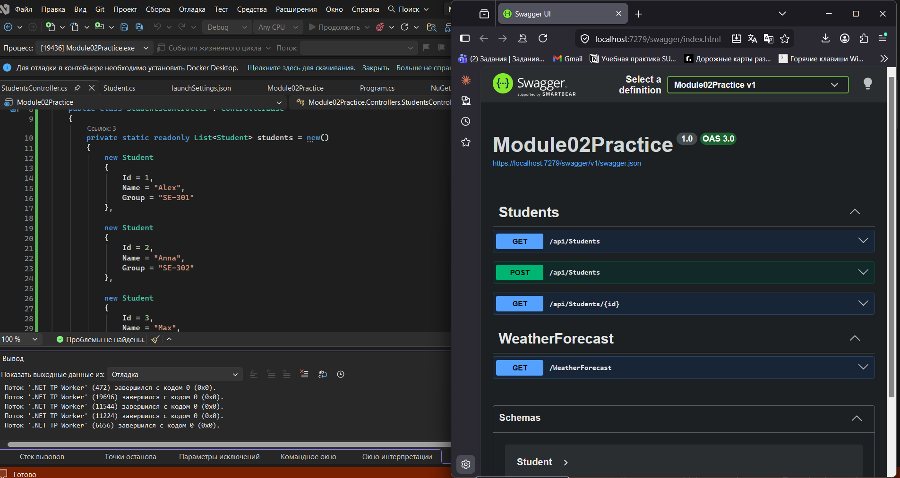
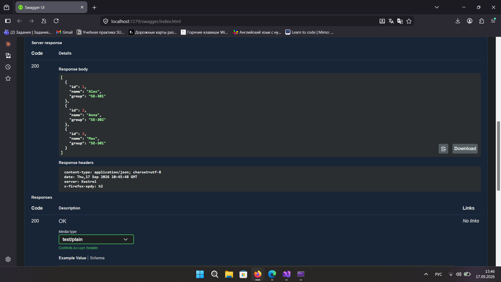
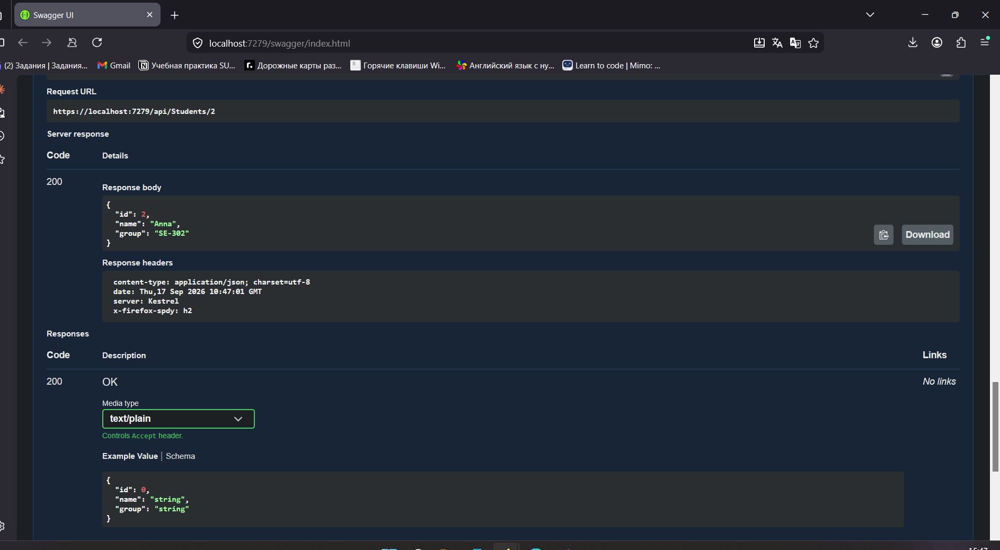
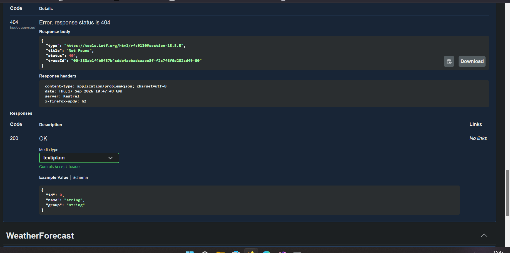
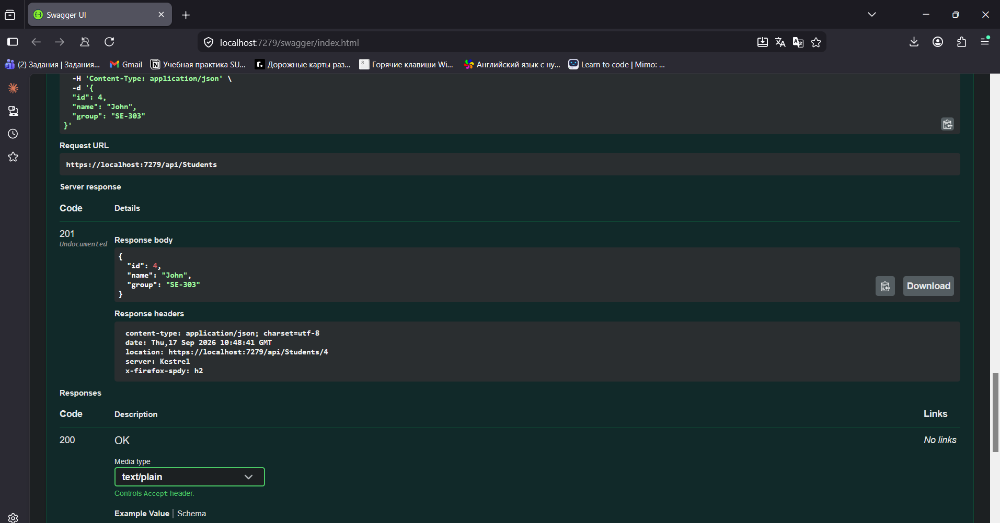
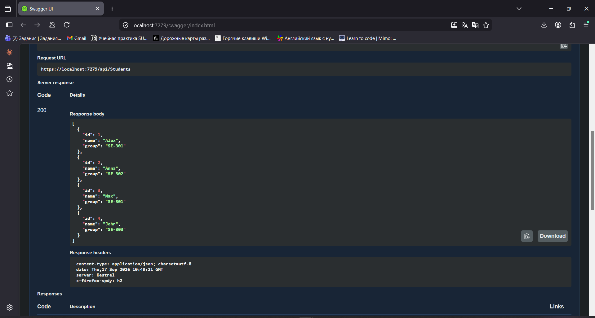

Проект сделан на .NET 10. Для проверки API использовал Swagger.

## Что реализовано

* `GET /api/students` - получение списка всех студентов
* `GET /api/students/{id}` - получение студента по Id
* `POST /api/students` - добавление нового студента
* `404 Not Found` - если студент с указанным Id не найден

## Swagger UI

После запуска проекта открывается Swagger, через который можно проверить все запросы.

## GET всех студентов

Запрос `GET /api/students` возвращает список всех студентов.

## GET студента по Id

Запрос `GET /api/students/{id}` возвращает одного студента по его Id.

## 404 Not Found

Если указать Id студента, которого нет в списке, API возвращает ошибку `404 Not Found`.

## POST

Через `POST /api/students` можно добавить нового студента.

После добавления нового студента снова выполнил `GET /api/students` и проверила, что он появился в списке.

## Итог

В результате получилось Web API с контроллером `StudentsController`, моделью `Student` и тремя основными запросами: GET, GET по Id и POST. Все запросы были проверены через Swagger.
